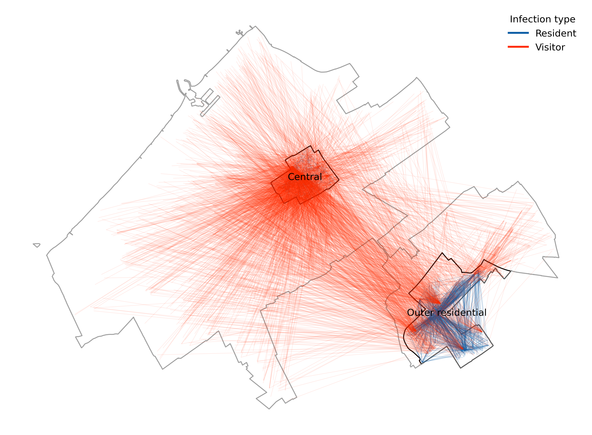
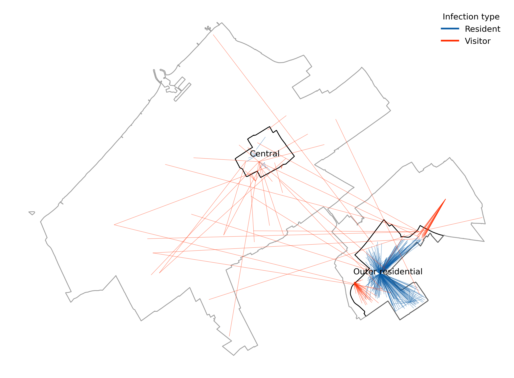
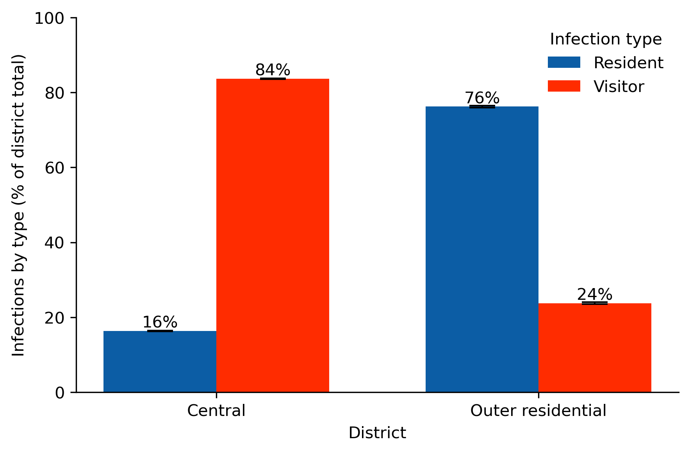
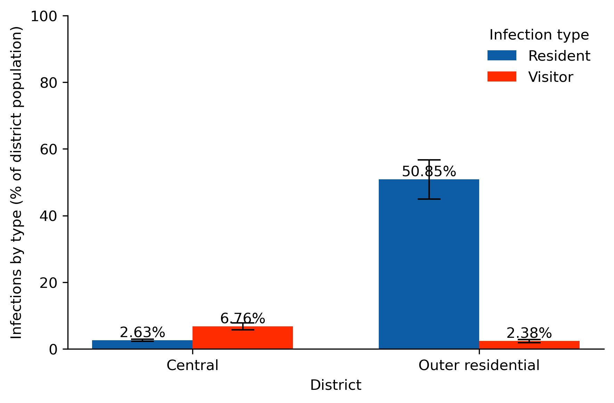
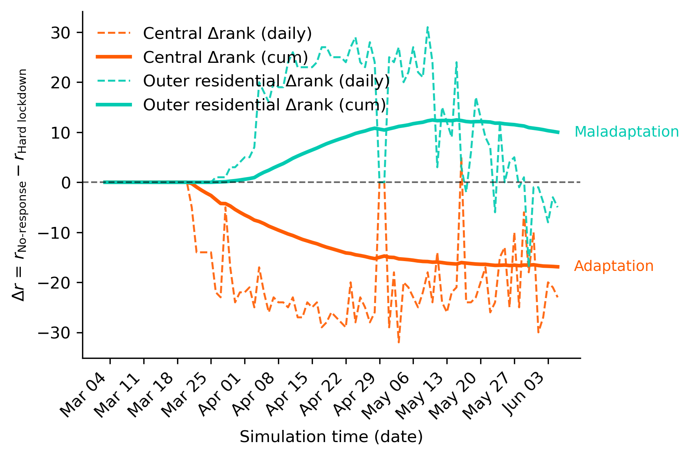

# On Urban Maladaptation in Times of Epidemics

This repository contains the analysis code for the paper **"On Urban Maladaptation in Times of Epidemics"** ([DOI:10.1038/s41598-025-33158-5](https://doi.org/10.1038/s41598-025-33158-5)).

Using a large-scale agent-based model of The Hague (Netherlands) during the COVID-19 pandemic, we explore how "one-size-fits-all" crisis interventions can lead to unintended consequences in heterogeneous urban environments. We find that a uniform lockdown policy can inadvertently increase infection risk in some districts while protecting others. We refer to this phenomenon as **urban maladaptation**, drawing on the established concept of maladaptation from climate studies (e.g., [Schipper, 2020](https://www.sciencedirect.com/science/article/pii/S2590332220304838)).

## The (Urban) Context: Central vs. Outer Residential Districts

Our analysis focuses on two contrasting districts in The Hague:
  * **Centrum (Central):** The high-density city centre, with **113 amenities** (shops, restaurants, etc.) per 1,000 residents.
  * **Ypenburg (Outer residential):** A less dense, affluent residential district on the periphery, with only **11 amenities** per 1,000 residents.

Despite similar population sizes, these districts' different urban social fabrics caused them to react in fundamentally different ways to a uniform policy.

## Our Key Finding: The "Risk Flip"

Our model reveals that a uniform lockdown "flips" the geography of infection risk.
<table>
<tr>
<th>No-response Scenario</th>
<th>Hard Lockdown Scenario</th>
</tr>
<tr>
<td width="50%" valign="top" align="center">

<br/>
<em>Without a lockdown, the Central district is a hotspot, driven by visitors (red lines) traveling to its dense amenities.</em>
</td>
<td width="50%" valign="top" align="center">

<br/>
<em>With a lockdown, the risk "flips." The Central district is safe, but the Outer residential district has continued local transmission among residents (blue lines).</em>
</td>
</tr>
<tr>
<td width="50%" valign="top" align="center">

<br/>
<em>Central district: Most of infections are from visitors.</em>
</td>
<td width="50%" valign="top" align="center">

<br/>
<em>Central district infections fall, while the Outer residential district sees a much smaller improvement.</em>
</td>
</tr>
</table>

**Why the flip?** The lockdown closed the Central district's amenities, eliminating visitor-driven spread. In the Outer residential district, residents were forced to concentrate in their *few* local supermarkets, creating new, localised infection hubs.

## Quantifying Maladaptation: The Urban Adaptation Index (UAI)

We introduce the **Urban Adaptation Index (UAI)**, a simple metric to quantify how policy interventions spatially redistribute risk. The UAI tracks how a district's infection risk *ranking* changes compared to the baseline.

  * **Negative UAI (Adaptation):** The district's rank improves (it becomes relatively safer).
  * **Positive UAI (Maladaptation):** The district's rank worsens (it becomes relatively riskier).

<p align="center">

</p>

<p align="center">
<em>The Central district adapts (negative UAI), while the Outer residential district experiences maladaptation (positive UAI).</em>
</p>

## Repository Structure

```
├── figures/              # Generated figures (EPS, PDF, PNG, SVG)
├── notebooks/            # Analysis notebooks
│   ├── 1.1-no-response.ipynb
│   ├── 1.2-maladaptation.ipynb
│   ├── 1.3-uai.ipynb
│   ├── 2-supplementary-info.ipynb
│   └── utils.py          # Helper functions
└── results/              # Simulation results
    ├── baseline/         # No-response scenario results
    └── lockdown/         # Hard lockdown scenario results
```

## Reproducing the Analysis

### Requirements

The analysis uses Python with just a few basic packages:

  * `pandas`, `numpy` - Data manipulation
  * `geopandas` - Spatial analysis
  * `matplotlib`, `seaborn` - Visualisation

### Running the Notebooks

The analysis is organised into sequential notebooks:

1.  **`1.1-no-response.ipynb`** - Analysis of the no-response (baseline) scenario
2.  **`1.2-maladaptation.ipynb`** - Analysis of the hard lockdown scenario and maladaptation patterns
3.  **`1.3-uai.ipynb`** - Calculation and visualisation of the Urban Adaptation Index
4.  **`2-supplementary-info.ipynb`** - Supplementary information and additional analyses

After downloading the input data from [4TU.ResearchData](https://doi.org/10.4121/33c01ff0-d3af-4293-8690-339bbca2bb37) and placing it in the `results/` directory, run notebooks in sequence to reproduce the figures and results presented in the paper.

## Data & Model

### Agent-Based Model

Our analysis is based on a large-scale agent-based model simulating the daily lives of all citizens of The Hague, including:

  * Socio-demographic characteristics (age, household size, etc.)
  * Daily activity schedules (work, shopping, meeting friends)
  * Places of interest (schools, supermarkets, parks, etc.)
  * Mobility patterns
  * Area-based disease transmission and SEIRD progression models
  * Policy interventions (closures, social distancing, masks, etc.)

**Model code**: Available at [github.com/averbraeck/medlabs-heros](https://github.com/averbraeck/medlabs-heros)

### Datasets

**Simulation input data**:
  * [Time Use Survey (TUS) Netherlands 2019](https://digital.scp.nl/timeuse2/about-the-time-use-survey/)
  * [Onderweg in Nederland (ODiN) travel survey 2019](https://www.cbs.nl/nl-nl/onze-diensten/maatwerk-en-microdata/microdata-zelf-onderzoek-doen/microdatabestanden/odin2019-onderweg-in-nederland-2019)
  * OpenStreetMap PBF file (January 2020)
  * [Municipality of The Hague demographic and business data (2020)](https://denhaag.incijfers.nl/)

**Simulation outputs**: Available at [4TU.ResearchData](https://doi.org/10.4121/33c01ff0-d3af-4293-8690-339bbca2bb37)

## Citation

```bibtex
@article{sirenko2026maladaptation,
  title={On Urban Maladaptation in Times of Epidemics},
  author={Sirenko, Mikhail and Verbraeck, Alexander and Comes, Tina},
  journal={Scientific Reports},
  year={2026}
}
```

## Authors
  * *Mikhail Sirenko* - [:octocat: github.com/miskh](https://github.com/miskh)
  * *Alexander Verbraeck* - [:octocat: github.com/averbraeck](https://github.com/averbraeck)
  * *Tina Comes* - [:briefcase: LinkedIn](https://nl.linkedin.com/in/tina-comes-a084ab27)

## Acknowledgments

This research was supported by the European Union's Horizon 2020 research and innovation programme under grant agreement No 101003606.

Mikhail Sirenko is extremely grateful to *Daan van Bilsen*, *Sahiti Sarva*, *Jin Rui Yap*, *Fabio Tejedor*, *Anmol Soni*, *Hidde Bijlard*, and *Srijith Balakrishnan* for their enormous contribution to the foundation of this work.

## License

Please refer to the specific license terms associated with the datasets and model code linked above.
